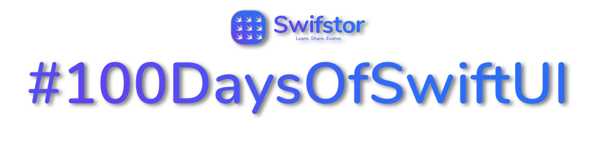

In this challenge we will cover one ***_SwiftUI_*** topic every week .

|         | Our Progress  |
----------|-----------------
:zero: | _Hello Pundit_  ↪ [Getting Started](https://github.com/KhamkhaDeveloper/100DaysOfSwiftUI/tree/master/HelloPundit).
:one: | _Image Challenge_  ↪ [Working with images](https://github.com/KhamkhaDeveloper/100DaysOfSwiftUI/tree/master/ImageChallenge)
:two: | _StackAndScroll_  ↪ [Working with StackView And ScrollView](https://github.com/KhamkhaDeveloper/100DaysOfSwiftUI/tree/master/ImageChallenge)

## Open Source & Copying

This repo is absolutely free and for learning purpose. feel free to download the code or share.
It is licensed under MIT so that you can use my code in your app, if you choose.

However, **please do not forget to give star if it helps you**

## Why are we building this?

- To Learn ***SwiftUI*** from scratch
- To Help community learn and share
- open contribution if possible
